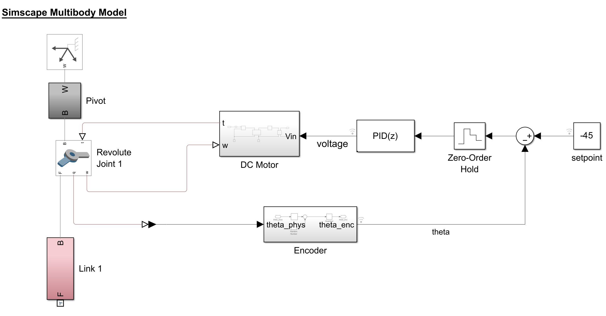

👨‍🔬 Modeling a Pendulum in Simscape
=================================

This repository contains the material required to support a tutorial for the Simscape environment, in which you will learn how to model a pendulum and control it through a DC motor.

| |
| :---: |
|  |
|  |

### 📋 Prerequisites
Required applications:
 - Matlab
 - Simulink

Required toolboxes:
 - Control System Toolbox
 - Simscape
 - Simscape multibody

### 🔢 Basic Steps
1. Approach the multidomain world by adding a DC motor to control the pendulum.
2. Add a gearbox to the system with its own damping and inertia.
3. Add noise and quantization to the feedback to simulate encoder behaviour.

With MATLAB you can design, simulate, and implement controllers for more complicated systems such as an [inverted pendulum](https://mathworks.com/videos/inverted-pendulum-control-with-simmechanics-and-quarc-106862.html).

<!--

### 🎓 Assignment
Copy out `step_8.slx` into `step_9.slx`. Then, use `step_9.slx` to develop a controller that will let the pendulum rotate at a constant velocity.  

To complete the assignment do:
1. [Generate][1] a copy of this repository into your own account. Tick in the option "include all branches" ✔
1. [Create the branch][2] `solution` off of the branch `master`.
1. [Commit][3] into the branch `solution` the following files:
    1. the model `step_9.slx`;
    1. a screenshot of the graph of the angle velocity.
1. [Push][4]/sync the changes up to GitHub.
1. [Create a pull request][5] (**PR**) with `master` as _base branch_ and `solution` as _compare branch_.
1. [Request to review your PR][6] 👋 to turn in the assignment.

 [1]: https://github.com/icub-tech-iit/training-matlab-pendulum/generate
[2]: https://help.github.com/articles/creating-and-deleting-branches-within-your-repository
[3]: https://git-scm.com/docs/git-commit
[4]: https://help.github.com/articles/pushing-to-a-remote
[5]: https://help.github.com/articles/creating-a-pull-request
[6]: https://help.github.com/articles/requesting-a-pull-request-review -->
