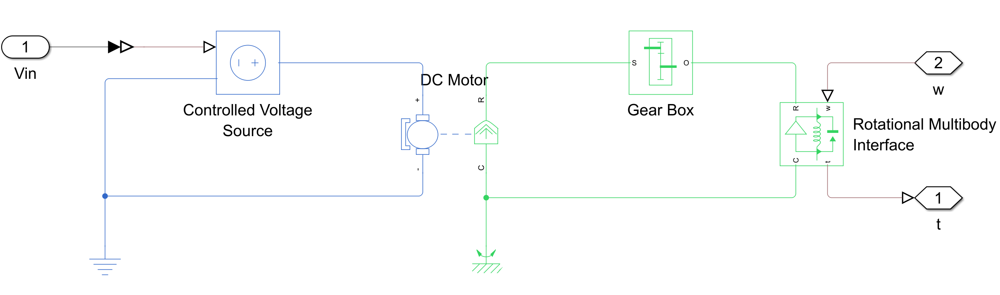

👨‍🔬 Modeling a motor-controlled pendulum in Simscape
=================================

This tutorial builds on the concepts laid out in the following instructional repository: [icub-tech-iit/training-matlab-pendulum](https://github.com/icub-tech-iit/training-matlab-pendulum) . In there, the pendulum is modelled and controlled by first writing down the governing equations, then by moving to the Simscape Multibody environment.

Here we enter in the multidomain field: we make the model more realistic by adding a DC motor and modeling the encoder noise characteristics. 

| |
| :---: |
|  |
|  |
|  |

### 📋 Prerequisites
Required applications:
 - Matlab
 - Simulink

Required toolboxes:
 - Control System Toolbox
 - Simscape (all domains)
 - Simscape multibody

Tutorials:
 - [Simscape Onramp](https://it.mathworks.com/learn/tutorials/simscape-onramp.html)

### 🔢 Basic Steps
1. Approach the multidomain world by adding a voltage-controlled DC motor and a gearbox to control the pendulum.
2. Digitize the controller, then add noise and quantization to the feedback to simulate encoder behavior.

With MATLAB you can design, simulate, and implement controllers for more complicated systems such as an [inverted pendulum](https://mathworks.com/videos/inverted-pendulum-control-with-simmechanics-and-quarc-106862.html).
